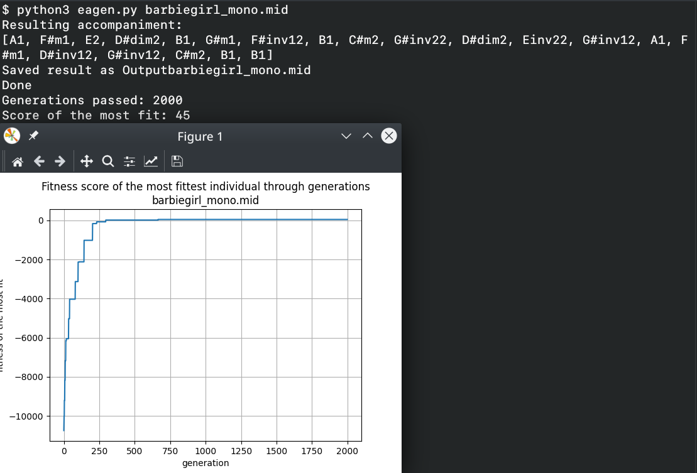

# EA MIDI Accompaniment Generator #

Produces an accompaniment to a monophonic MIDI file using evolutionary algorithms.
Several tests for a chord fitness are derived; see `examples/report.pdf` for more info

## Getting started ##

1. Install dependencies:
```# pip3 install -r requirements.txt```

2. Run the script:
```$ ./eagen.py input.mid```


Output file `output_input.mid` will be produced.

## Example ##

